## Lap Practical 01: Identity and Access Management

**Aims/Objectives**

- The aim of this practical is to learn about the basic concepts of aws identity and access management (IAM) and how to use it to manage access to AWS resources.
- Create instance and create profile for it.
- 

**Introduction**

AWS Identity and Access Management (IAM) is a web service that helps to securely control access to AWS services and resources for the users. IAM enables us to manage permissions for AWS services and resources, allowing us to grant or deny access to specific actions and resources.

### Procedure

Starting with completion of persistent storage for the floci and its health.
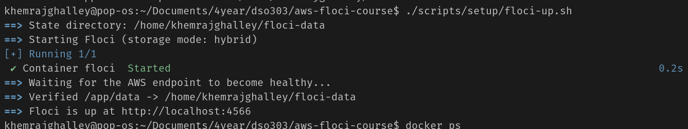

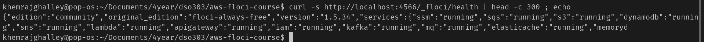
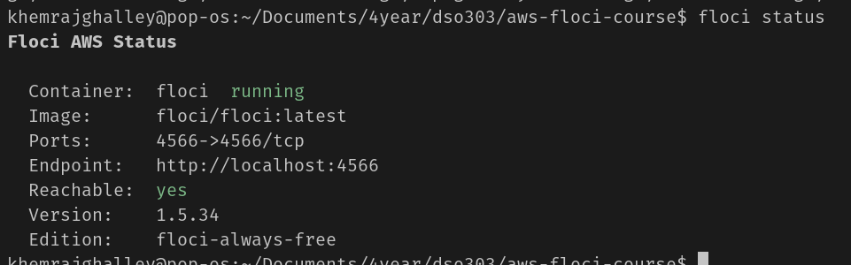

it looks like the persistent storage is set up correctly and the floci is healthy. lets proceed with the next step of the practical that is installing the aws cli amd configure floci aws CLI profile.

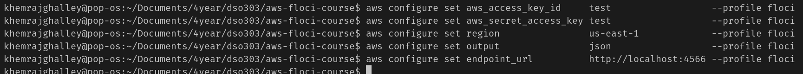

This shows that 
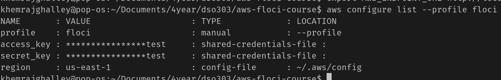

Run aws configure list --profile floci. Identify which column tells you where each value came from, and explain why the Type for the access key says shared-credentials-file.
- The LOCATION column tells where each value came from. The Type for the access key says shared-credentials-file because it is stored in the shared credentials file, which is located at ~/.aws/credentials.

Executing my first aws command 
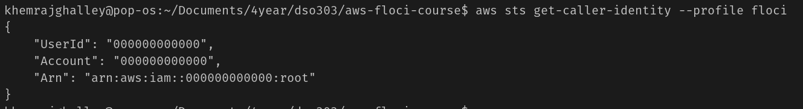
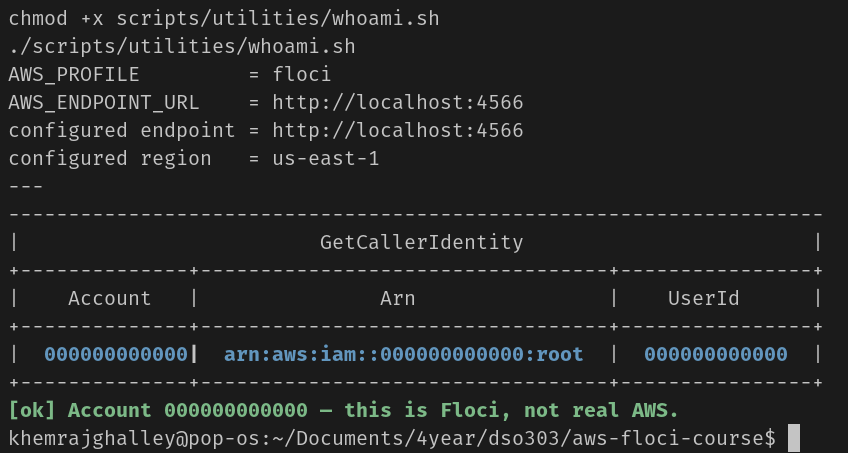
It shows that I am not real aws user by looking at the userid.

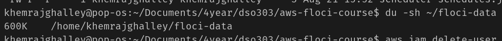
It shows that my floci is persisted.

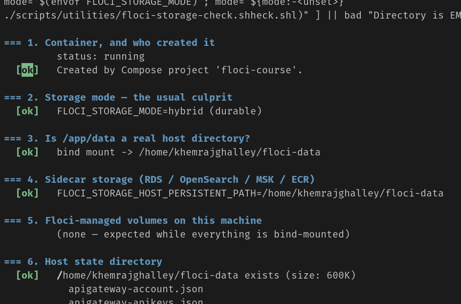
this output shows that everything is working perfectly fine.

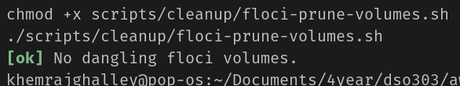
This output shows that floci is not using stray vlolume.

End of part A

### Building the IAM Foundation

**4 IAM building blocks**

USER: identity that represents a person or service that interacts with AWS resources.
GROUP: group of users that share the same permissions.
ROLE: identity that can be assumed by anyone who needs it.
POLICY: A JSON object that says ALLOW or DENY access to AWS resources.

basic rules to remember:
- Default deny: all requests are denied by default, unless explicitly allowed.
- Explicit deny always wins: if a request is explicitly denied, it will be denied even if there is an allow policy that would otherwise allow it.

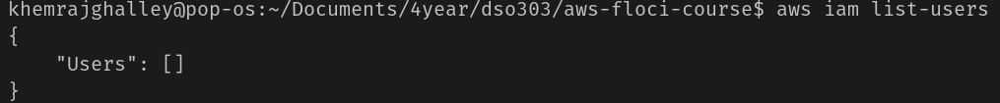
My account exist, but there is no user created yet. 

Run aws iam list-roles --output table. Floci may pre-create some service-linked roles. Are the results the same in text format? Which one would you use inside a script, and why?
- I would use the table format because when there is no user created, text format doesn't show any output. The table format shows the table with the column names and the values, which is more readable.

**Create the IAM groups**

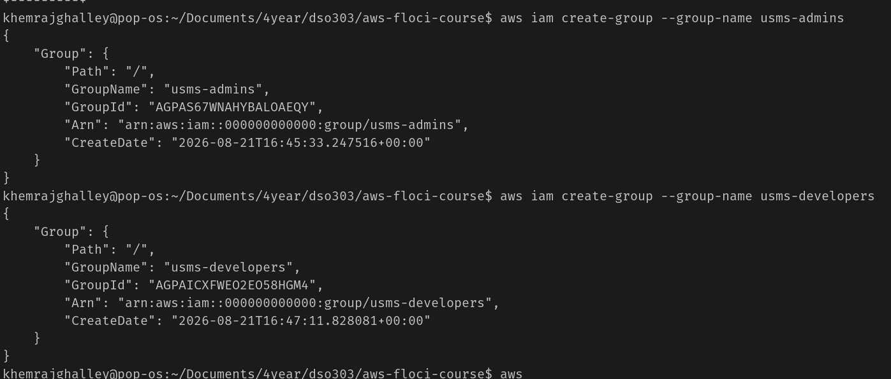
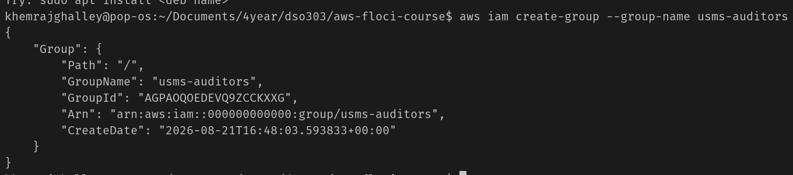

created an empty IAM group. A group has no permissions and no members.

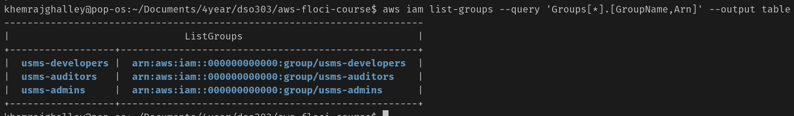
It shows IAM group created

**Create the IAM users and capture their ARNs**

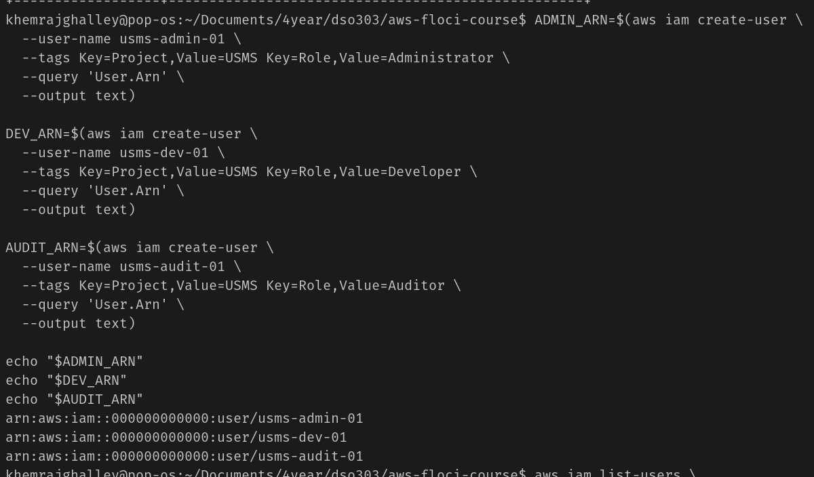

veritying that the IAM user is created and capturing the ARN of the user.
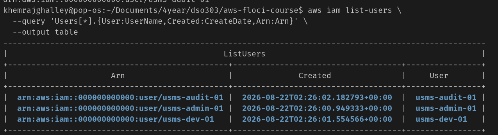

created the user usms-intern-01 with other 3 users.
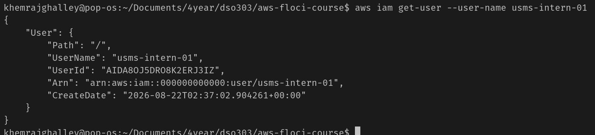

**Add users to groups**
adding the users to the group created earlier.

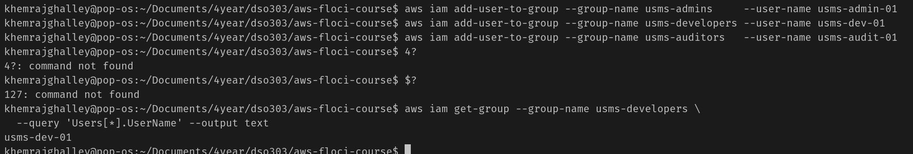
we can even verify that the users are added to the group.

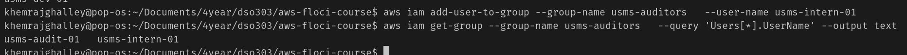
I added user "usms-intern-01" to the group usms-auditors, now usms-auditors have 2 users.

**Explore and attach an AWS managed policy**

now its time to attach policy
- policy is just a document which defines the permissions for a user, group or role. In simple term it says who has access to which resources.

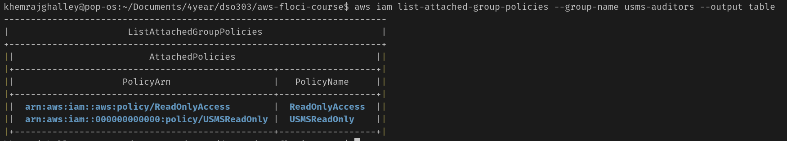
created the policy and assigned it to the group usms-auditors.

One policy can be attached to multiple users or group. 

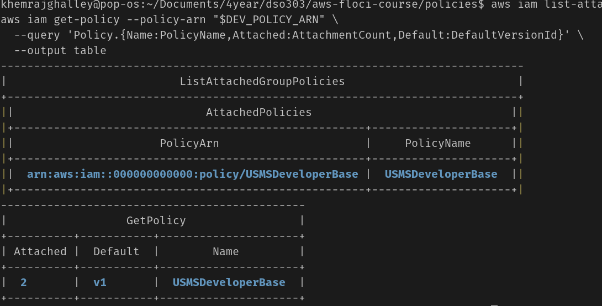

It was clearly stated that s3 cannot be listed.

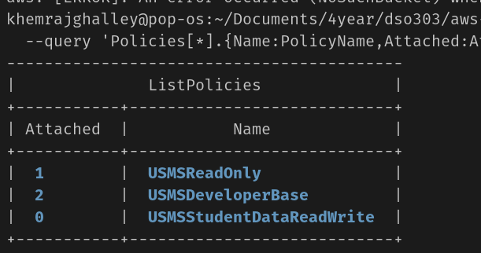

Generate a skeleton for aws iam create-policy and for aws ec2 create-vpc (you will need the latter in Lab 2). Save both in templates/. Which parameter of create-vpc looks like the most important one?
- The most important parameter of create-vpc is the "CIDR block" because defines the IP address range for the VPC. We need to always make sure that the CIDR block does not overlap with any other VPC.

**Add an inline policy**

Inline policies are policies that are assigned directly to a user. it is not reusable like managed policies. It is useful when there is specific permission that is needed for a user.

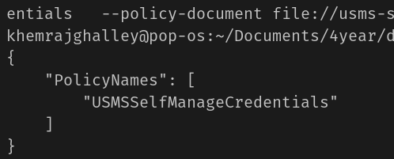

**Important Note:** 
- Inline policies are not recommended for production use since it is not resuable and can be difficult to manage.

**Policy versions**

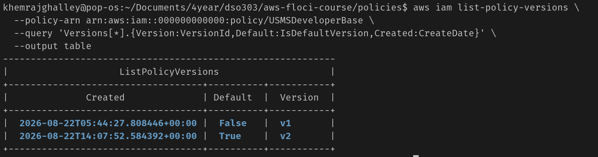
created new version(v2) of the policy.
- policy may hold 5 versions, not more than that. If there is need to create a new version, we have to delete the old version first and create new one.

**Create a role for EC2, with a trust policy**

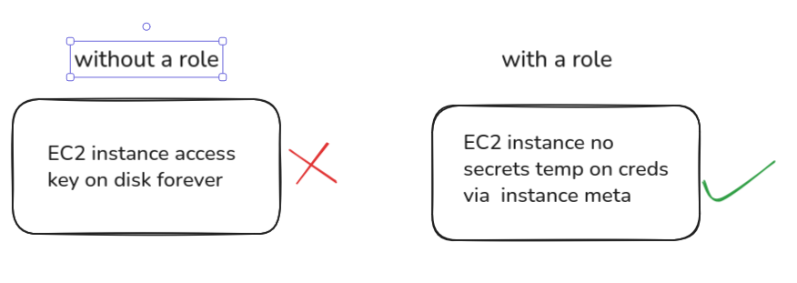

--assume-role-policy-document it is trust policy that defines which entities can be trusted to assume the role. 
- trust and permission are completely different. 

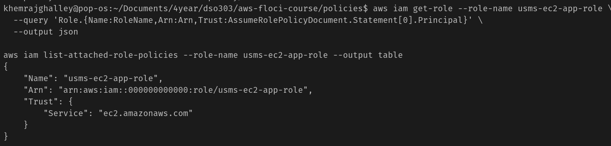

**Create the instance profile**

for ec2 instance a role cannot be given directly, rather it is given through instance profile. instance profile is a container of an IAM role.

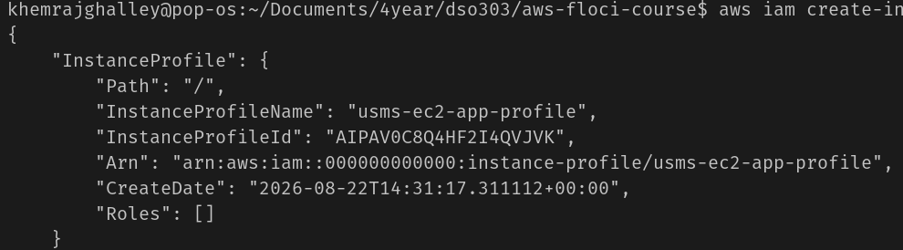
created instace profile

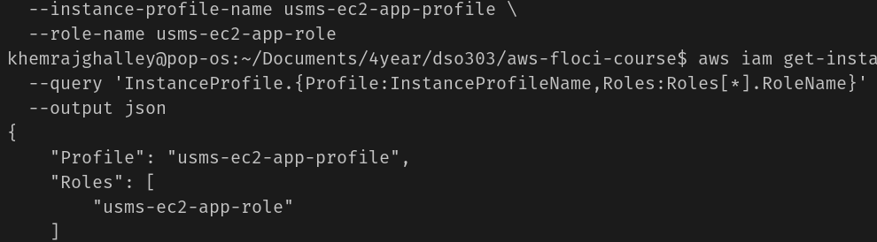
result of assigning or attaching the role to the instance profile.

**Create the Lambda execution role**

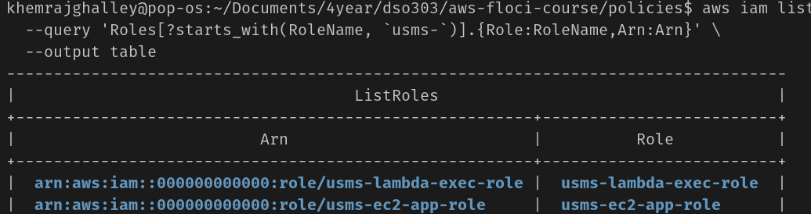
created lamda execution role and even assigned the role.

**A role for humans, and temporary credentials with STS**

Eleveted permissions are used for some tasks that require more permissions than the user has. It is a best practice to use elevated permissions only when needed and for a limited time.

Trust policy need to be acepted by both the user and the role. The user needs to have permission to assume the role, and the role needs to trust the user.

**Test permissions with the policy simulator**
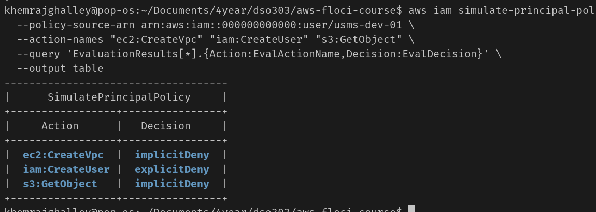
three decision:
- allowed: the action is allowed by the policy.
- explicit deny: the action is explicitly denied by the policy.
- implicit deny: the action is not allowed by the policy, but it is not explicitly denied

**Reflection**

I really faced challenges understanding small concepts/words in between the practical. I had to read the documentation or use ai for understanding. Though I was able to complete the practical, I still feel like I need to learn more about the AWS services and how to use them effectively. Its really challenging to think of its architecture as it grows bigger and bigger. I will continue to practice and learn more about AWS IAM and other services in the future.

**Conclusion**
Summarise the practical in one or two paragraphs.
Include:

    Whether the objectives were achieved
    Key concepts learned
    Skills developed
    Importance of the AWS service

AWS IAM is a important service for managing access to AWS resources securely. It allows organizations to implement the principle of least privilege, it ensures that users are assigned enough permission to do their task. If they they need extra permission they concept of elevated permissions can be introduced for limited duration. 

Now when it comes to the aws services, I crearly remember creating instance profile for the instance since we cannot directly assign role to it. Though I created worked with multiple services I didn't really understand about the lamda function. 
