## Virtual Private Cloud and Networking

**Aims/Objectives**
- To create web tier which can be accessed from the public internet
- Data tier which is not accessible from the public internet

**Prerequisites**
everything is perfectly fine to start with practical 2.
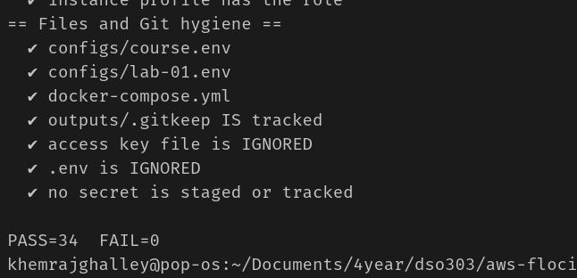

- aws accepts the vpc CIDR block in the range of /16 to /28.
- subnet CIDR block must be a subset of the VPC CIDR block.
- each subnet must not overlap with any other subnet in the VPC

**Assume the developer role and create the VPC**

making sure I am in right place to create the VPC.
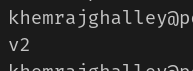
It shows that I am in the right region and lets create VPC

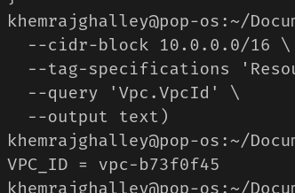
VPC created

**Restore your normal identity**

From my perspective, in this step we are restoring the normal identity after creating the VPC. because we created the VPC using the developer role, now we need to switch back to our normal identity. and that user have session duration of 1 hour. 
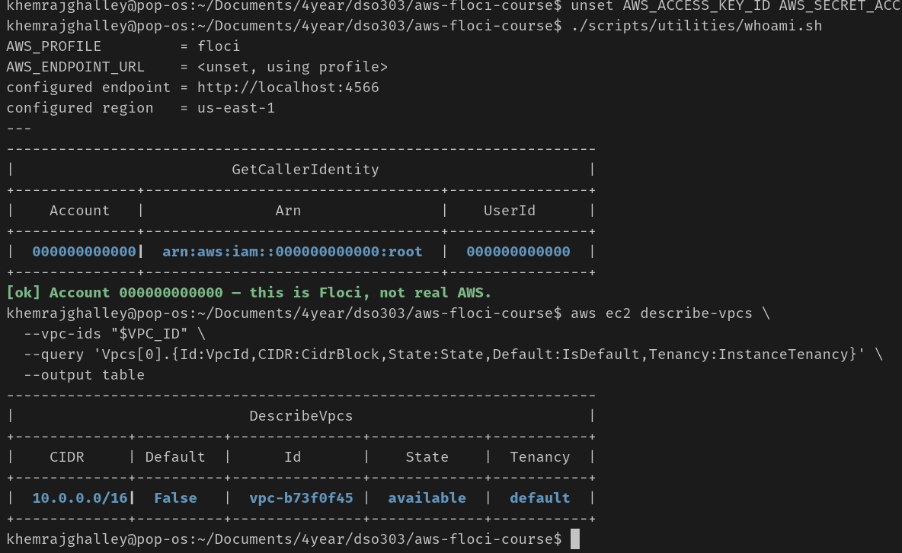

**Enable DNS support and DNS hostnames**

when vpc is created using CLI it automatically enables DNS resolution but does not enable DNS hostnames. 
- Means no public DNS name for instances with public IP addresses.
- Service endpoints inside the VPC won't resolve to their private addresses.
- To avoid confusion later, let's enable DNS hostnames now.

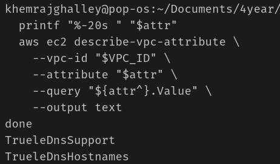
completed enabling DNS support and DNS hostnames.

**Create and attach the internet gateway**

Internet gateway is VPC component that allows communication between instances in VPC the internet.
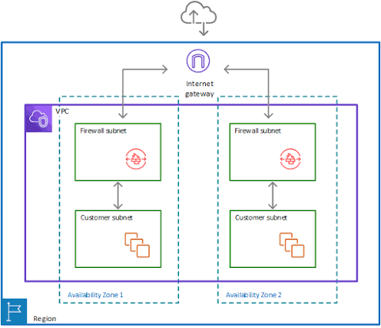
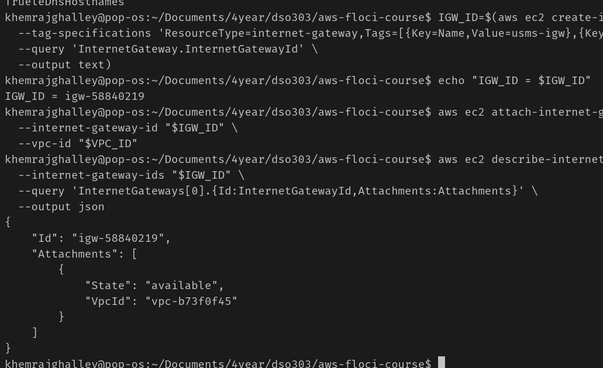

Internet gateway is created and attached to the VPC. It can be attached to only one VPC at a time. 

**Create the public subnet in us-east-1a**

Let's create public subnet for web tier. 
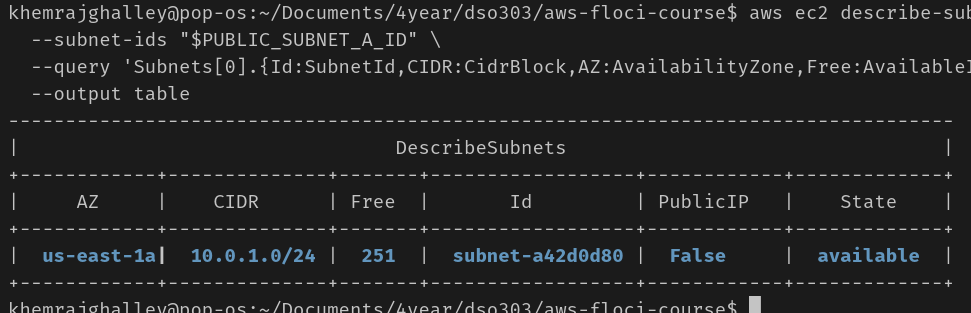
in aws 5 first four and lasp IP address is reserved for network, broadcast and VPC router. So we have 251 usable IP addresses in the public subnet.

**Turn on auto-assign public IPv4 for the public subnet**

By default, instances launched in a subnet get private IP addresses only. So to allow instances to communicate with the internet, we need to enable auto-assign public IP address for the public subnet.
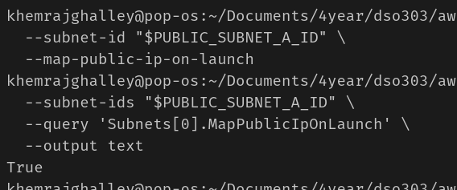

**Create the private subnet in us-east-1a**

The reason for creating private subnet is to create data tier which is not accessible from the public internet.
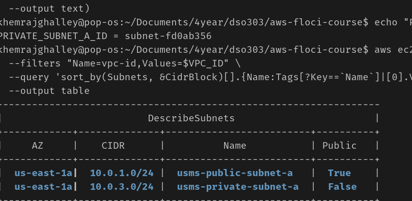

**Create the public route table and the default route**

Every subnets in a VPC can talk to each other by default. But to allow instances in the public subnet to communicate with the internet, we need to create a route table and add a default route that points to the internet gateway.
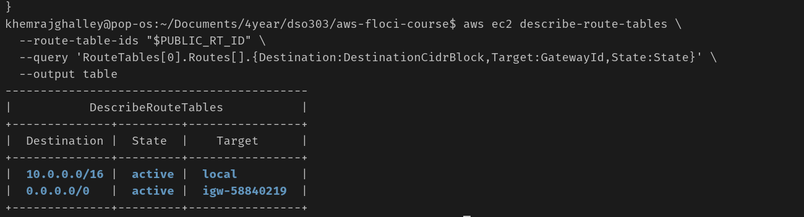

**Associate the public subnet with the public route table**

We need to tell the public subnet to use the public route table so that it can access the internet.

A subnet has exactly one route table associated with, if it is not associated with one, it uses the VPC's main route table.

**Create the private route table and associate the private subnet**

The private route table is create and associated with the private subnet. The private route table does not have a default route to the internet gateway, so instances in the private subnet cannot communicate with the internet.

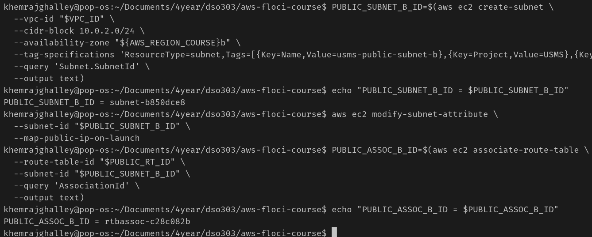
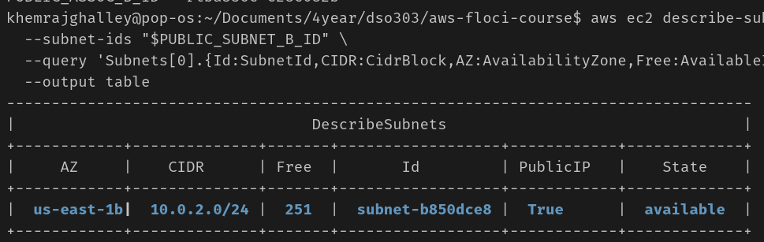

There is new new public subnet created
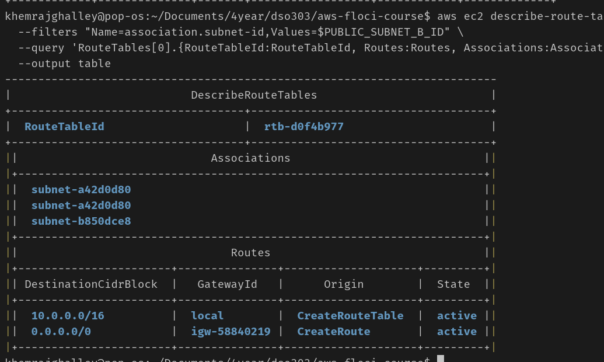

**Prove the two subnets are actually different**

Checking the route tables for both subnets to prove that they are actually different. The public subnet has a default route to the internet gateway, while the private subnet does not.
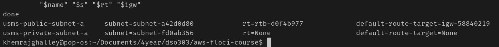

**Create the application security group**

this secutity is attached to the web server and allows HTTP traffic from anywhere on the internet.

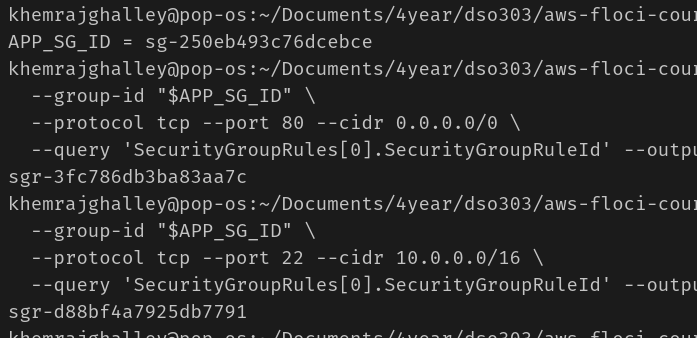

**Exercise**

Allow TCP 443 from anywhere on the internet. 
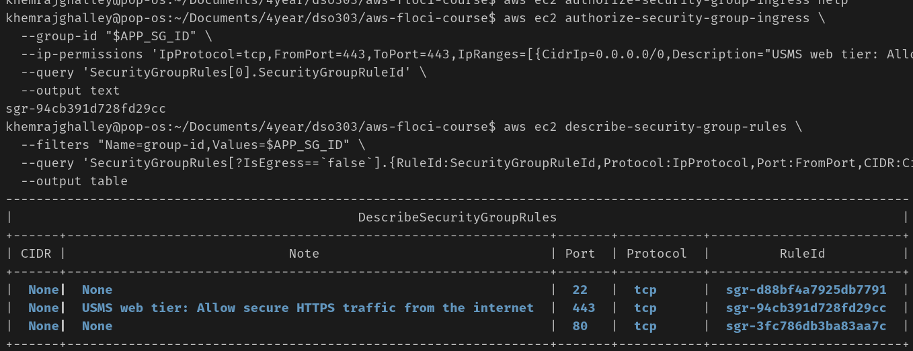

**Create the database security group, sourced from the application group**

The database security group should only allow traffic from the application security group, not from the public subnet directly. This way, even if the IP addresses change, the security group rules will still apply correctly.

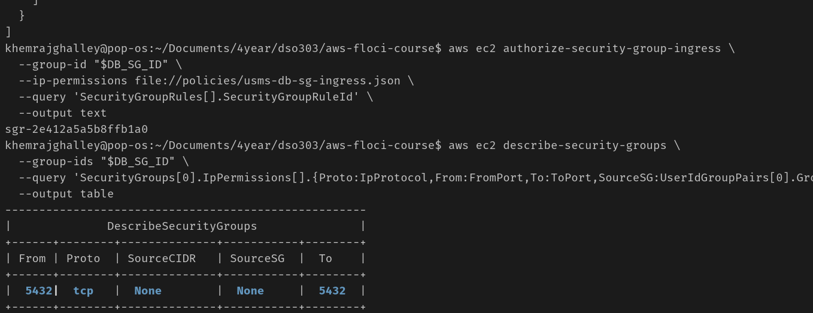

**Read the groups back, and understand what stateful means**

Security groups are stateful, meaning if you allow an incoming request from a specific IP, the response is automatically allowed, regardless of outbound rules.

**Explore the default network ACL, then create a private one**

Private subnet contains sensitive data, to protect data, we use a NACL on the subnet as extra layer of security.
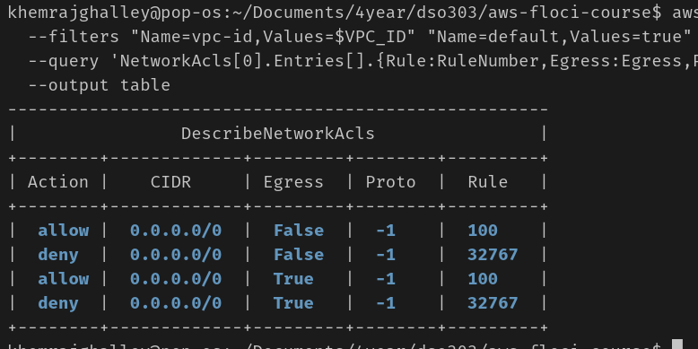

NACL deny by fault all inbound and outbound traffic. need to remember few rules. let's add rules.

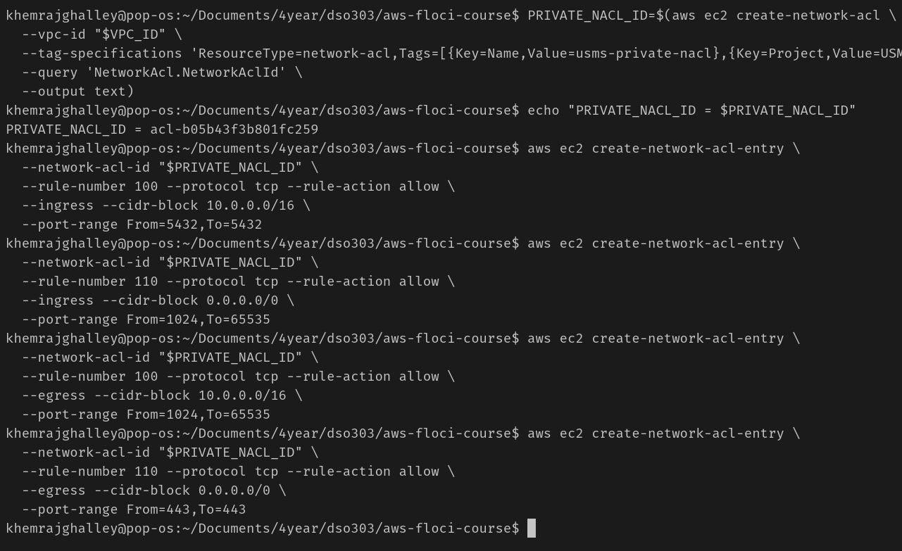
- added inbound rule to allow access to postgreSQL anywhere from inside VPC.
- return traffic for connections this subnet opened outbound.
- replies to the application tier
- HTTPS out

**Associate the private NACL with the private subnet**

NACL is already associated with the private subnet. So we need to disassociate it first and then associate the new NACL with the private subnet.

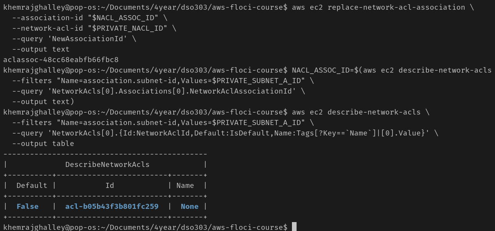

**Give the private subnet outbound internet access with a NAT gateway**

The NAT gateway allows the private subnet to access the internet for updates while keeping it secure from incoming traffic. 

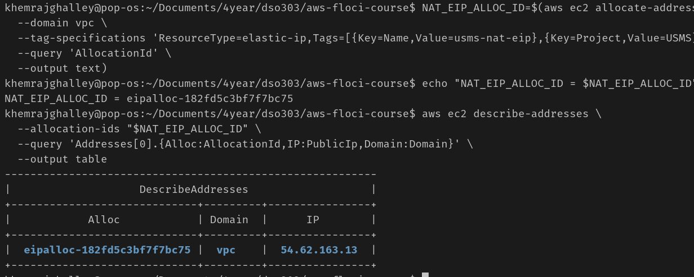

create the NAT gateway in the public subnet
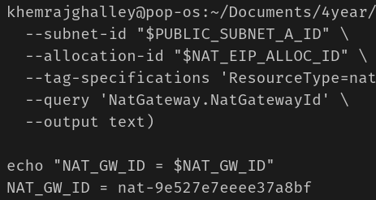

**Point the private route table at the NAT gateway**

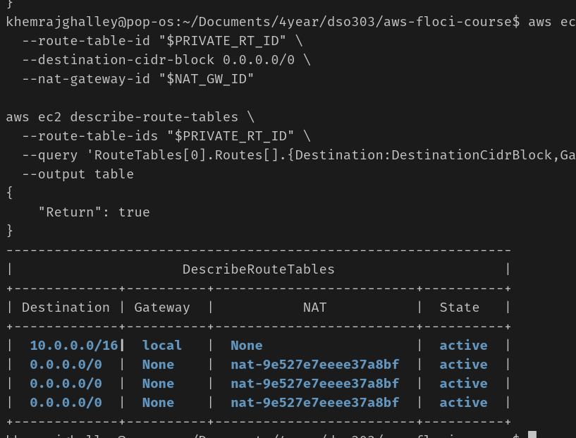

**Create the S3 gateway endpoint**

## Building VPC and Launching a Web Server

**Task 1: Create Your VPC**

A secure virtual network is created in us-east-1 and 2 subnets are created that are public and private. The public subnet is configured to have external access to the internet, while the private subnet is configured to have no access to outside world. 

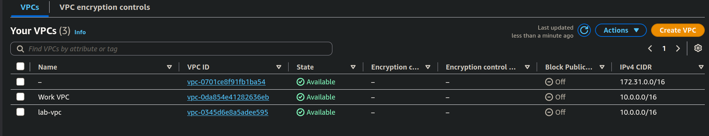

**Task 2: Create Additional Subnets**

Created two additional subnets for the VPC in second availability Zone. The first public subnet (10.0.2.0/24) is linked to the Internet Gateway. The second private subnet (10.0.3.0/24) is linked to the NAT Gateway so it can safely download updates without being exposed to the internet. The route table need to be configured to expose the subnet. 

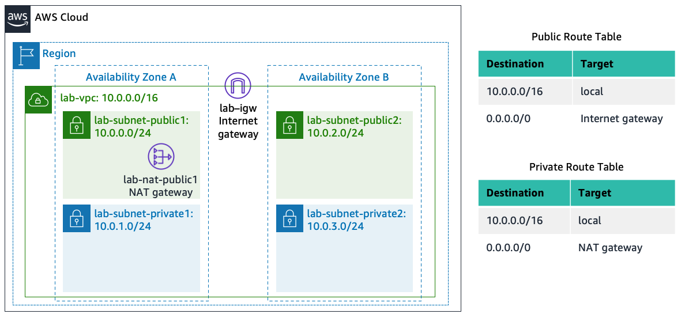
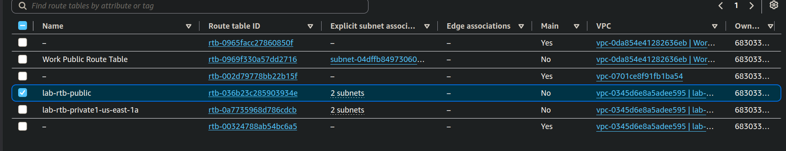

**Task 3: Create a VPC Security Group**

Successfully created a security group inside the lap-vpc. The security group is configured to allow HTTP traffic from anywhere on the internet that is (0.0.0.0/0). 

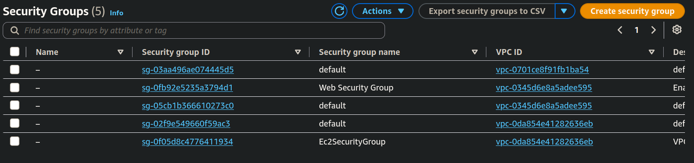

**Task 4: Launch a Web Server Instance**

Final Outcome: Deployed a t2.micro instance named Web Server 1 running Amazon Linux 2023 within lab-subnet-public2. It was assigned a public IP and protected by the Web Security Group. A user data startup script successfully automated the installation of Apache, PHP, and a database, pulling down the lab application files so the web server became fully accessible via its public IPv4 DNS address.

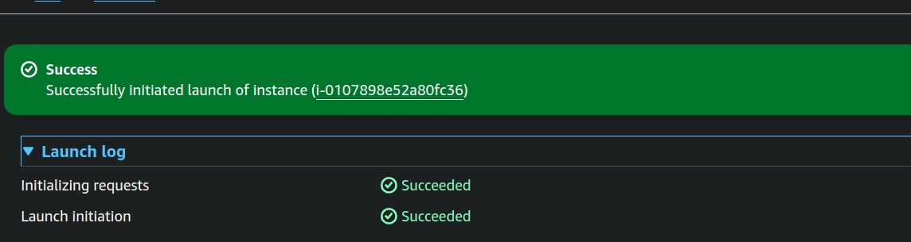
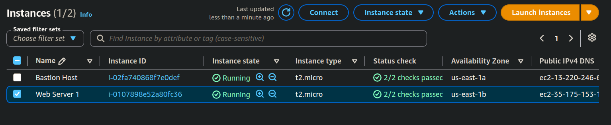